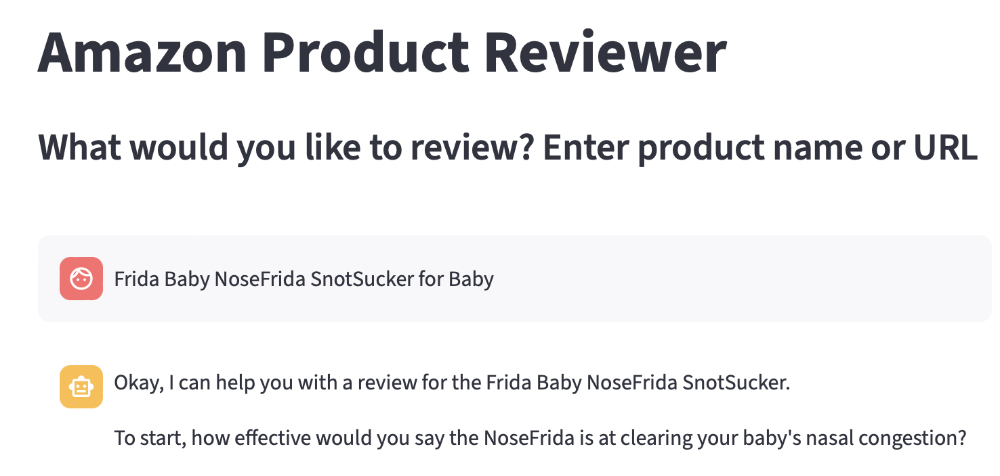

# amazon-reviewer
Agent to guide user through crafting a personalized and insightful review of products purchased on Amazon.

This project is a demo to showcase the utilization of agent frameworks to create a conversational agent.

## Motivation
I write a lot of Amazon Reviews, and this little life hack makes the process more interactive, engaging, and fun. It helps me be more thorough in addressing all the necessary features, while still maintaining my own feedback and tone. 

The final crafted reviews are now more insightful and useful for other shoppers, and strictly adhere to Amazon's review guidelines (focus on product, not on delivery, packaging, etc.)

## Core Concepts Demonstrated

*   **Meta-prompting:** The agent's behavior is guided by a detailed meta-prompt (in `prompts.py`) that defines its persona, goals, and rules of engagement.
*   **ReAct Agent:** The project uses a ReAct (Reasoning and Acting) agent created with LangGraph, which can use tools to gather information and achieve its goals.
*   **Tool Usage:** The agent is equipped with tools to search the web and retrieve product information (defined in `tools.py`).
*   **Conversational Memory:** The agent maintains a history of the conversation to provide a coherent and contextual experience.

## Infrastructure with Terraform

This project uses Terraform (`terraform/`) to define and manage its Google Cloud infrastructure, including the Cloud Run service and integration with Google Secret Manager for secure credential handling.

## Main Files

*   **`app.py`**: A Streamlit application that provides a web-based chat interface for interacting with the agent.
*   **`console_test.py`**: A command-line interface for testing and interacting with the agent directly in the terminal.
*   **`agent.py`**: Initializes the language model and creates the ReAct agent using LangGraph, binding the model, tools, and prompt together.
*   **`prompts.py`**: Contains the core meta-prompt that defines the agent's persona and behavior as an Amazon product reviewer.
*   **`tools.py`**: Defines the tools available to the agent, such as web search and product information retrieval.
*   **`requirements.txt`**: Lists the Python dependencies for the project.
*   **`Dockerfile`**: A file to build a docker image of the application.